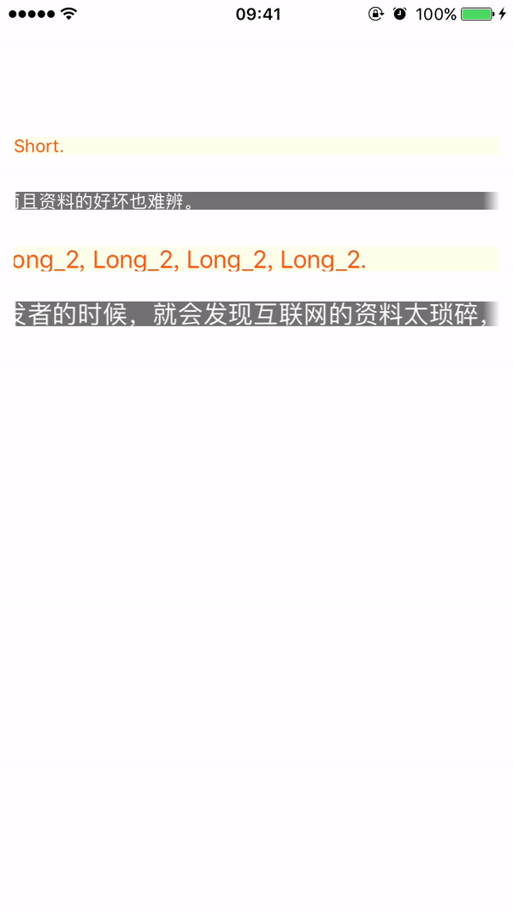

# EFAutoScrollLabel

[](https://travis-ci.org/EyreFree/EFAutoScrollLabel)
[](http://cocoapods.org/pods/EFAutoScrollLabel)
[](http://cocoapods.org/pods/EFAutoScrollLabel)
[](http://cocoapods.org/pods/EFAutoScrollLabel)
[](https://travis-ci.org/EyreFree/EFAutoScrollLabel)

A label which can scroll when text length beyond the width of label, in Swift.

> [中文介绍](https://github.com/EyreFree/EFAutoScrollLabel/blob/master/README_CN.md)

## Overview



## Example

To run the example project, clone the repo, and run `pod install` from the Example directory first.

## Requirements

- XCode 8.0+
- Swift 3.0+

## Installation

EFAutoScrollLabel is available through [CocoaPods](http://cocoapods.org). To install
it, simply add the following line to your Podfile:

```ruby
pod "EFAutoScrollLabel", '~> 1.0.2'
```

## Setup

Simply initialize a `EFAutoScrollLabel` the same way you set up a regular `UILabel`:

```swift
let myLabel = EFAutoScrollLabel(frame: CGRect(x: 10, y: 10, width: 200, height: 40))
self.view.addSubview(myLabel)
```

## Use

#### 1. Import EFAutoScrollLabel module where you want to use it:

```swift
import EFAutoScrollLabel
```

#### 2. Initialize a `EFAutoScrollLabel` and set some parameter:

```swift
let myLabel = EFAutoScrollLabel(frame: CGRect(x: 10, y: 10, width: 200, height: 40))
myLabel.backgroundColor = UIColor(red: 253.0 / 255.0, green: 255.0 / 255.0, blue: 234.0 / 255.0, alpha: 1)
myLabel.textColor = UIColor(red: 249.0 / 255.0, green: 94.0 / 255.0, blue: 22.0 / 255.0, alpha: 1)
myLabel.font = UIFont.systemFont(ofSize: 13)
myLabel.labelSpacing = 30                       // Distance between start and end labels
myLabel.pauseInterval = 1.7                     // Seconds of pause before scrolling starts again
myLabel.scrollSpeed = 30                        // Pixels per second
myLabel.textAlignment = NSTextAlignment.left    // Centers text when no auto-scrolling is applied
myLabel.fadeLength = 12                         // Length of the left and right edge fade, 0 to disable
myLabel.scrollDirection = AutoScrollDirection.Left
myLabel.observeApplicationNotifications()
self.view.addSubview(myLabel)
```

#### 3. `AutoLayout` is also supported.

## PS

The first version of [EFAutoScrollLabel](https://github.com/EyreFree/EFAutoScrollLabel) is converted from [AutoScrollLabel](https://github.com/firewolf-ljw/AutoScrollLabel/commit/6981994ad64ab3b29b87a423109f556134c83b41).

## Author

EyreFree, eyrefree@eyrefree.org

## License

EFAutoScrollLabel is available under the MIT license. See the LICENSE file for more info.
