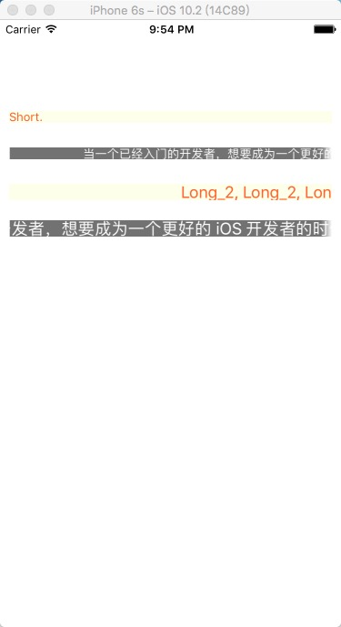

# EFAutoScrollLabel

[](https://travis-ci.org/EyreFree/EFAutoScrollLabel)
[](http://cocoapods.org/pods/EFAutoScrollLabel)
[](http://cocoapods.org/pods/EFAutoScrollLabel)
[](http://cocoapods.org/pods/EFAutoScrollLabel)
[](https://travis-ci.org/EyreFree/EFAutoScrollLabel)

A label which can scroll when text length beyond the width of label, in Swift.

## Overview



## Example

To run the example project, clone the repo, and run `pod install` from the Example directory first.

## Requirements

- XCode 8.0+
- Swift 3.0+

## Installation

EFAutoScrollLabel is available through [CocoaPods](http://cocoapods.org). To install
it, simply add the following line to your Podfile:

```ruby
pod "EFAutoScrollLabel"
```

## Setup

Simply initialize a `EFAutoScrollLabel` the same way you set up a regular `UILabel`:

```swift
let myLabel = EFAutoScrollLabel(frame: CGRect(x: 10, y: 10, width: 200, height: 40))
self.view.addSubview(myLabel)
```

## PS

The first version of [EFAutoScrollLabel](https://github.com/EyreFree/EFAutoScrollLabel) is converted from [AutoScrollLabel](https://github.com/firewolf-ljw/AutoScrollLabel/commit/6981994ad64ab3b29b87a423109f556134c83b41).

## Author

EyreFree, eyrefree@eyrefree.org

## License

EFAutoScrollLabel is available under the MIT license. See the LICENSE file for more info.
